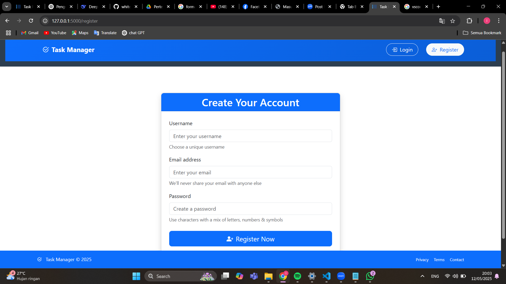
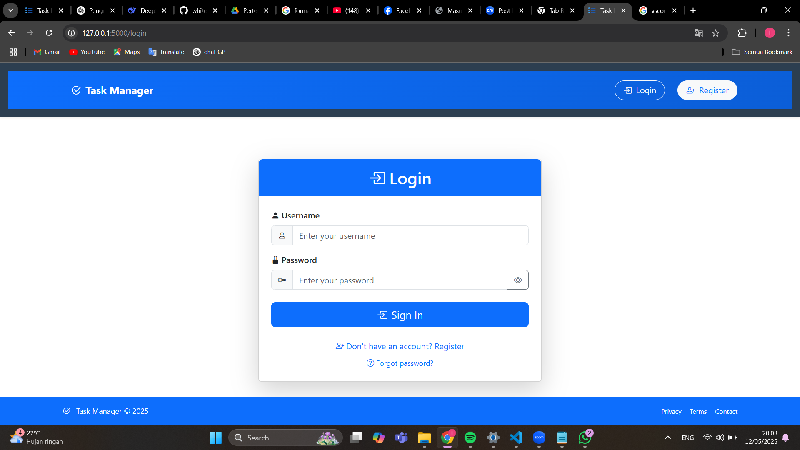
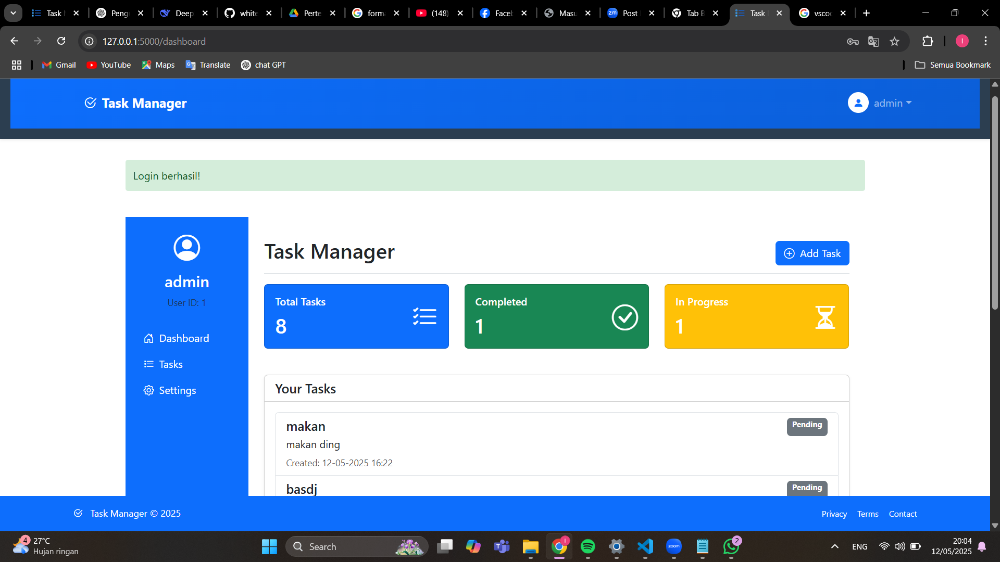
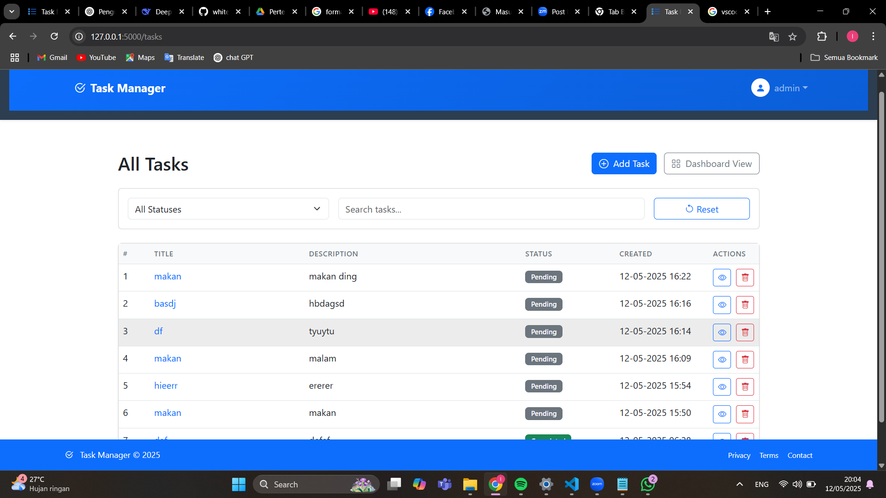
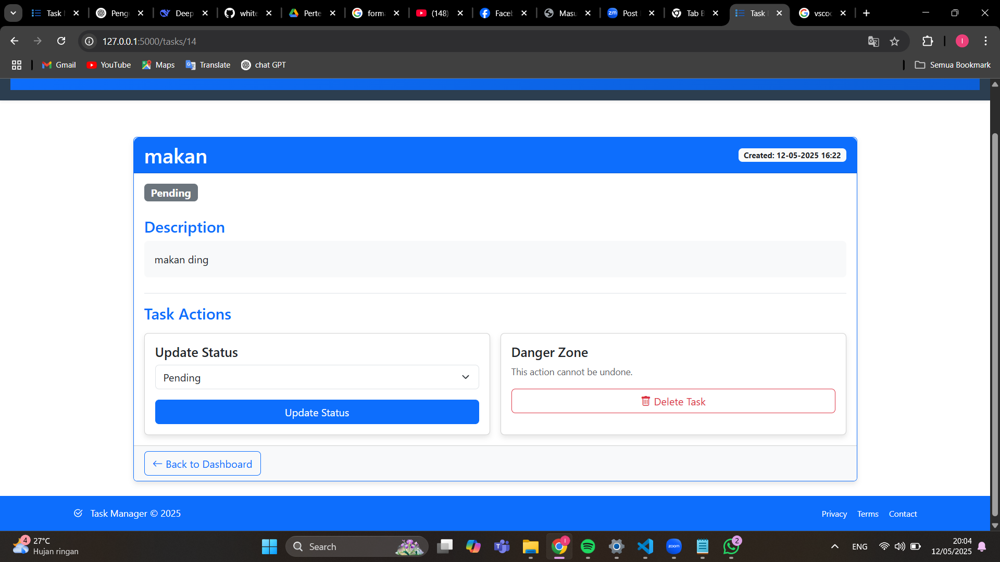

# Task Manager Web Application

## Deskripsi Aplikasi

Task Manager adalah aplikasi berbasis web yang membantu pengguna dalam mengorganisir dan mengelola tugas-tugas sehari-hari secara efisien. Aplikasi ini dirancang dengan antarmuka yang intuitif dan fitur-fitur produktivitas untuk memudahkan pelacakan pekerjaan.

## Fitur Utama

- **Manajemen Tugas**:
  - Buat, edit, dan hapus tugas

- **Antarmuka Pengguna**:
  - Tampilan daftar tugas yang terorganisir

## Teknologi yang Digunakan

- **Frontend**: HTML5, CSS3, JavaScript
- **Backend**: python
- **Database**: SQLite

 **Cara penggunaan**
1. download source code
2. ekstrak
3. open code editor
4. run requirements.txt
5. open url local host
6. enjoy :D

  
| Keterangan         | Informasi        |
| ------------------ | ---------------- |
| Nama Aplikasi      | Task Manager   |
| Bahasa Pemrograman | Python 3 (Flask) |
| sumber daya pendukung | html, css, javaScript |
| Database           | SQLite           |
| Modul Utama        | `app.py`         |
| Pengembang         | [Rahman Fauza, Aida Sucia, Muhammad Hafizha Ramadhani]   |
| NIM/NPM            | 20221310034, 2022131001, 20221310027      |

# Dokumentasi

## Register
| fitur               | Screenshot |
|---------------------|------------|
| Form register (username, email, password,) |  |
| Form login (username & password) |  |
| Tampilan utama dashboard |  |
| all task |  |
| detail task |  |

