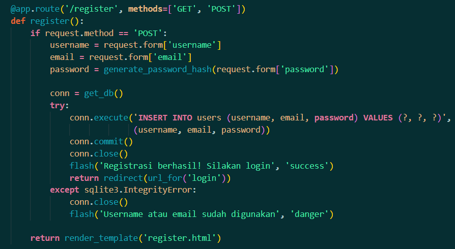
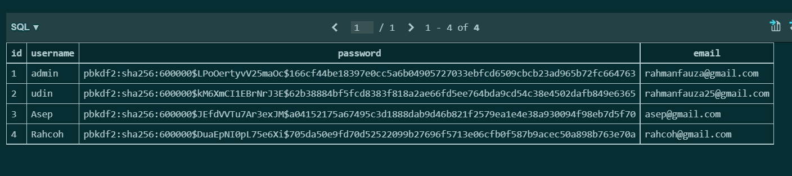

| Komponen        | Deskripsi Pemeriksaan                                          | Hasil Pemeriksaan                             | Screenshot Code                         | Screenshot Tampilan                   |
| --------------- | -------------------------------------------------------------- | --------------------------------------------- | --------------------------------------- | ------------------------------------- |
| `register()`    | Input disimpan di DB dengan `generate_password_hash()`         | ✔️ Password tersimpan dalam bentuk hash       |  |       |
| `login()`       | Password diverifikasi dengan `check_password_hash()`           | ✔️ Login berhasil jika password benar         |          |  |
| `add_task()`    | Waktu Jakarta (`get_jakarta_time()`) disimpan dalam ISO format | ✔️ Timestamp disimpan dengan benar            |       |     |
| `delete_task()` | Hanya user dengan `user_id` yang sesuai bisa menghapus task    | ✔️ Hanya task milik sendiri yang bisa dihapus |    |   |
