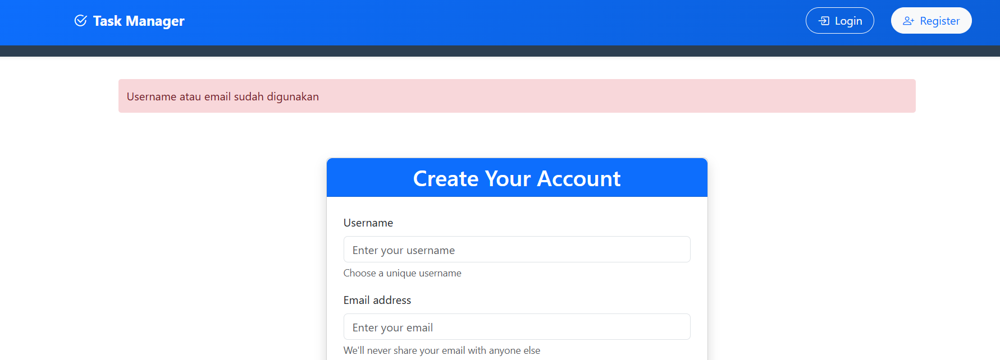
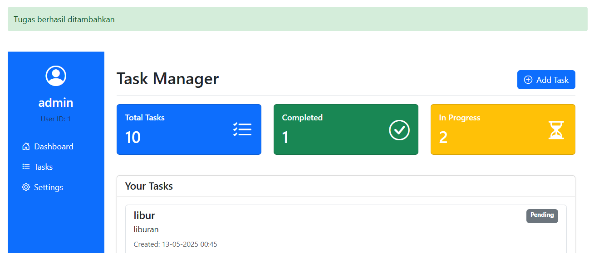
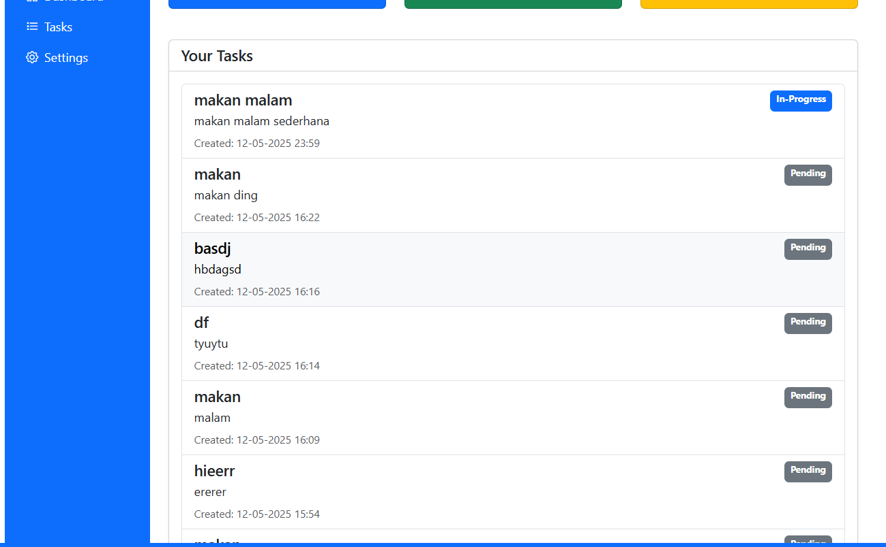
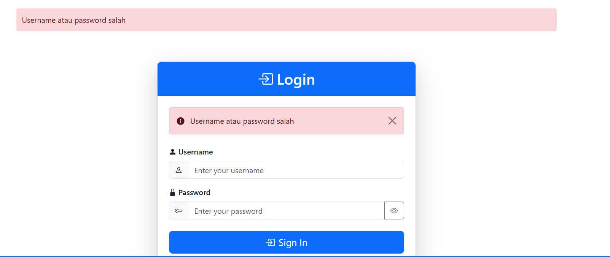
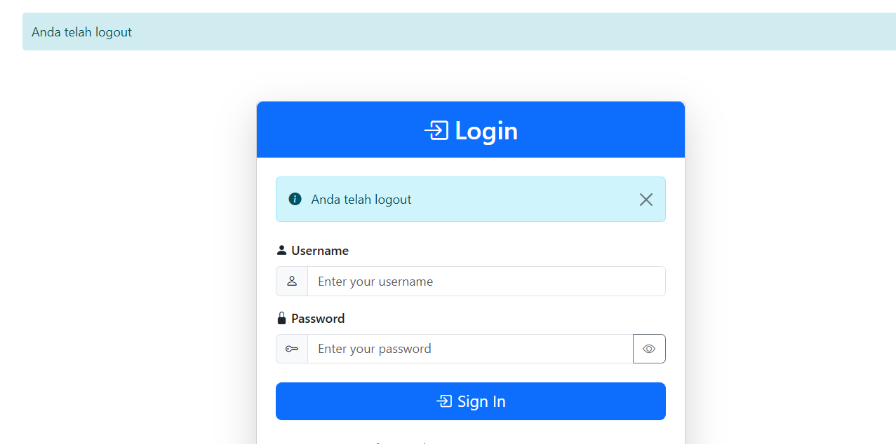
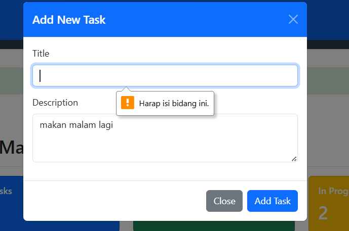

# Code Walkthrough
| No | Fitur / Bagian                | Cuplikan / Deskripsi Kode Utama                                                                                         | Hasil Analisis / Penjelasan                                                                                         | Screenshot |
|----|-------------------------------|--------------------------------------------------------------------------------------------------------------------------|----------------------------------------------------------------------------------------------------------------------|------------|
| 1  | Inisialisasi DB (`init_db`)   | Membuat tabel `users` & `tasks` jika belum ada                                                                           | DB menggunakan SQLite, sudah menyertakan `user_id` sebagai foreign key dan menyimpan `created_at` sebagai teks ISO. |       |
| 2  | Middleware Login              | `@app.before_request` memblokir semua halaman kecuali `login`, `register`, `static` jika belum login                   | Melindungi halaman secara global. Sudah aman dan efisien.                                                           |       |
| 3  | Register (`/register`)        | Menyimpan username, email, dan password hashed. Tangani duplikasi dengan `sqlite3.IntegrityError`                       | ✔️ Password disimpan aman, feedback error dengan `flash` saat username/email sudah dipakai.                         |       |
| 4  | Login (`/login`)              | Validasi user & password, cek dengan `check_password_hash`                                                               | ✔️ Session disimpan, user diarahkan ke dashboard setelah login berhasil.                                             |       |
| 5  | Logout (`/logout`)            | `session.clear()` dan redirect ke login                                                                                  | ✔️ Session dibersihkan, aman.                                                                                        |       |
| 6  | Dashboard (`/dashboard`)      | Ambil data `tasks` berdasarkan user dan urutkan berdasarkan `created_at` DESC                                            | ✔️ Tugas tampil dari terbaru ke terlama.                                                                            |       |
| 7  | Tambah Tugas (`/tasks/add`)   | Simpan data tugas: `title`, `description`, `user_id`, `created_at` dengan zona waktu Jakarta                            | ✔️ Format waktu sudah sesuai zona. Perlu validasi `title` kosong.                                                   |       |
| 8  | Validasi Form (manual)        | Tidak ada pengecekan eksplisit `if not title.strip()`                                                                    | ⚠️ Perlu ditambahkan validasi input kosong dan feedback ke user.                                                    |       |
| 9  | Tugas Detail (`/tasks/<id>`)  | Menampilkan detail tugas berdasarkan ID dan `user_id`                                                                    | ✔️ Aman. Mencegah akses tugas milik user lain.                                                                      |       |
| 10 | Update Status Tugas           | Mengubah kolom `status` berdasarkan `task_id` dan `user_id`                                                              | ✔️ Logika benar. Tidak bisa update milik user lain.                                                                 |       |
| 11 | Hapus Tugas (`/tasks/<id>`)   | Menghapus tugas berdasarkan `id` dan `user_id`                                                                           | ✔️ Aman, validasi user dilakukan.                                                                                   |       |
| 12 | Filter Tanggal (`datetime`)   | Fungsi `format_datetime` untuk menampilkan waktu dalam format Indonesia                                                  | ✔️ Tanggal jadi mudah dibaca.                                                                                       |       |
| 13 | Tampilan & Routing Tambahan   | Route `/settings`, `/tasks`, dll menampilkan data berdasarkan session user                                               | ✔️ Pemisahan data antar pengguna aman.                                                                              |       |

---

# Formal inpection
| Bagian           | Deskripsi                                                                           | Hasil Pemeriksaan                                     | Screenshot                                   |
|------------------|-------------------------------------------------------------------------------------|-------------------------------------------------------|----------------------------------------------|
| Autentikasi      | Menjelaskan route `/register`, proses penyimpanan dan validasi duplikasi            | ✔️ `sqlite3.IntegrityError` ditangani dengan `flash`  |     |
| Middleware Login | Peninjauan `@app.before_request`, hanya user login yang bisa akses halaman tertentu | ✔️ Redirect ke `/login` jika belum login              |  |
| Manajemen Tugas  | Menelusuri alur `/dashboard`: ambil `tasks`, urut berdasarkan `created_at`          | ✔️ Tugas tampil dari terbaru ke terlama               |    |
| Manajemen Tugas  | Proses pengisian form `add_task`, validasi input dan insert ke database             | ✔️ Data berhasil disimpan ke DB                       |     |
| Autentikasi      | Pemeriksaan fungsi `logout()` untuk membersihkan sesi dan mengarahkan ke login       | ✔️ Session dibersihkan, redirect ke login                |                                |
| Validasi Form    | Pengujian input kosong pada fungsi `add_task()` → form dikirim tanpa `title`         | ⚠️ Tidak valid, muncul pesan harus mengisi / input tidak diproses |                                |
