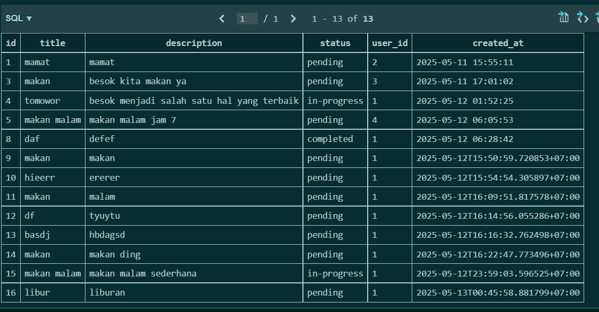

| Bagian           | Deskripsi                                                                           | Hasil Pemeriksaan                                     | Screenshot                                   |
|------------------|-------------------------------------------------------------------------------------|-------------------------------------------------------|----------------------------------------------|
| Autentikasi      | Menjelaskan route `/register`, proses penyimpanan dan validasi duplikasi            | ✔️ `sqlite3.IntegrityError` ditangani dengan `flash`  |     |
| Middleware Login | Peninjauan `@app.before_request`, hanya user login yang bisa akses halaman tertentu | ✔️ Redirect ke `/login` jika belum login              |  |
| Manajemen Tugas  | Menelusuri alur `/dashboard`: ambil `tasks`, urut berdasarkan `created_at`          | ✔️ Tugas tampil dari terbaru ke terlama               |    |
| Manajemen Tugas  | Proses pengisian form `add_task`, validasi input dan insert ke database             | ✔️ Data berhasil disimpan ke DB                       |     |
